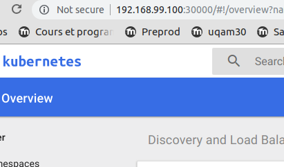
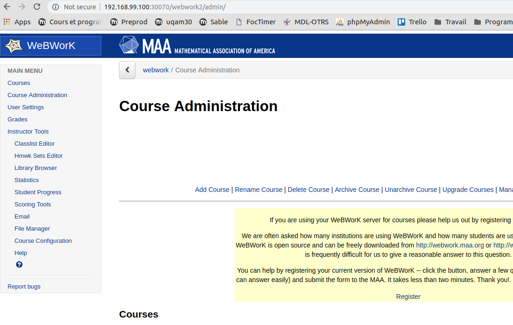

# Utilisation with minikube

### Installations

[Kubectl](https://kubernetes.io/docs/tasks/tools/install-kubectl/)

[Minikube](https://github.com/kubernetes/minikube)

### Preliminaries

The original diagram of what is implemented: [One note link](https://1drv.ms/f/s!AlNsK5gd2-LsgSrhNY3P7pbtUbkO)

Have `kubectl` and `minikube` installed.

Tested with version k8s 1.10 in an Ubuntu 18.04.

Start minikube
```
minikube start
``` 
once the bootstrap process end, be sure that you are in the correct `kubectl` context:
```
kubectl config get-contexts
```
The minikube one must have an `*` to its left.

To monitor that everything goes as expected, open the k8s dashboard with the command
```
minikube dashboard
```

Once the dashboard opens, you are going to need the ip there to modify accordingly the value `ENV WEBWORK_ROOT_URL`
in the `webworkdep.yaml` file.



In the picture case, you are going to use: `http://192.168.99.100:30070`

### Init Htdocs

The docker image created with the Dockerfile in this repo is `nmolleruq/ww2inithtdocs` its function is to initialise the shared folder htdocs.


### 1 Create ns

```
kubectl create ns test001
```

### 2 Generate the disks

```
 kubectl create -f disks.yaml
```

### 2.5 Populate shared folder

```
kubectl create -f initHtdocsPod.yaml
```

Watch the end of the downwloading by following the status of `inithtdocs` pod
```
kubectl -n test001 get pods --show-all=true
NAME                       READY     STATUS    RESTARTS   AGE
inithtdocs                 1/1       Running   0          8s
```
Wait until the `Completed` status:
```
kubectl -n test001 get pods --show-all=true
NAME                       READY     STATUS      RESTARTS   AGE
inithtdocs                 0/1       Completed   0          4m
```


### 3 Create the services 

```
kubectl create -f services.yaml
```

Before continuing, be sure that the `Persistent Volume Claims` are in bounded status.

### Deploy the db server

```
kubectl create -f mariadbdep.yaml
```

Wait until the mariadb container is fully provisioned. To do that, in the namespace `test001` ... watch the logs of the pod `mariadb-[....]` (Pods.. select the pod,... at your right in the upper corner.. the logs link is there)

On the logs page click `>|` to update the logs.

### And finally WebWork up

```
kubectl create -f webworkdep.yaml
```

Watch the logs of the webwork pod 


Tadammmm...



We have a version of `WeBWork2` in kubernetes.

### Debugging in error case
If you need to run something in the mariadb container:
```
(master)$ kubectl -n test001 get pods
NAME                       READY     STATUS    RESTARTS   AGE
mariadb-65b4888f96-tpz9r   1/1       Running   1          17h
webwork-68f4bd9bb6-ftdzt   1/1       Running   1          16h
(master)$ kubectl -n test001 exec -it mariadb-65b4888f96-tpz9r -- mysql -u root -prandomepassword

# In the ww2 container :
kubectl -n test001 exec -it webwork-68f4bd9bb6-ftdzt -- bash
```

Dont forget to read [Docker newbie instructions](https://github.com/openwebwork/webwork2/wiki/Docker-newbie-instructions) to get some hints (`OPL-update` par example). As you can imagine the `docker exec` instruction is equivalent to `kubectl exec`.

If something goes wrong in the `persistent storage`:

```
minikube ssh

cd /mnt/sda1/hostpath_pv/pv002
sudo rm -rf admin
```

To rebuild the database:

Delete the content of `/mnt/sda1/hostpath_pv/pv001` in the minikube machine.

### Disclaimer

:bomb:

:exclamation: It is intended to be a first experiment.... so please do not deploy in production :yum:

:o: As my knowledge of `ww2` is limited, as by what I see in the table `admin_key` we have a sort of session control... I suppose the real session data goes to somewhere else and usually the default is `disk`. So after finding where the data goes... that is a candidate to be persisted (Mike, Pao ?)

Maybe it is serialized in the `WeBWorKCourseAuthen.admin` cookie... it is in my question list too.

### Helming

Installing

[Helm](https://docs.helm.sh/using_helm/)

Look for an stable chart:

```
helm fetch stable/moodle
# currently wou are going to have: moodle-0.4.3.tgz
```

I'll use that chart as the basis for the `webwork` one.

To bootstrap the chart dev, we are going to start with the result of
```
tar -zxf moodle-0.4.3.tgz
```
in our `incubator/webwork` folder.
